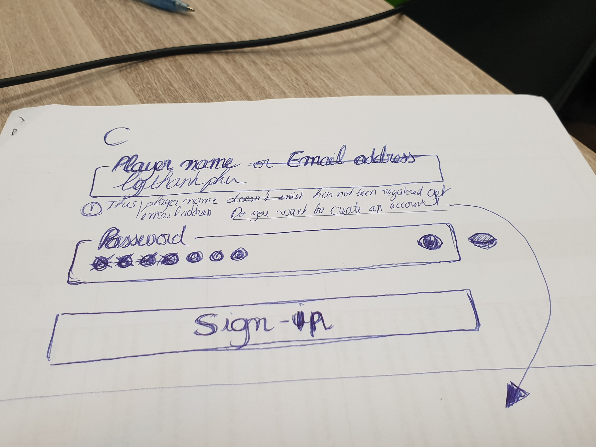

# Far Cry: Online Platform


[Far Cry is a first-person shooter (FPS) video game](https://www.youtube.com/watch?v=nkokvHtbZFI) with amazing graphics, developed by Crytek and published by Ubisoft. The game was released in 2004 for Microsoft Windows. The game was a huge commercial success. Ubisoft closed the online servers almost 12 years later.

Far Cry features a single player in which the player impersonates Jack Carver, an ex special forces soldier stranded on a mysterious archipelago. Far Cry also features several multiplayer modes in which players basically score points by killing other players.

Even if [Ubisoft closed the online servers in October 2015](https://forums.ubi.com/showthread.php/1241617-Why-can-I-no-longer-connect-to-Multiplayer-in-this-game?p=10959069), players can still play multiplayer matches by setting up LAN parties.


## Player Name

Players should enter a name (aka _multiplayer name_) before joining a multiplayer match. The default name is `Jack Carver`; if you don't change it, then that's the name you will be known by for every multiplayer match you join, until you change it. Far Cry engine displays player names in the final leaderboard, when the match finishes.

| Player Name Edition                                         | Leaderboard with Player Names                                                              |
| ----------------------------------------------------------- | ------------------------------------------------------------------------------------------ |
|  |  |

Far Cry engine also logs all the frags with killers' and victims' player name:

```bash
$ cat ./logs/log00.txt | grep killed | head
<26:32> <Lua> papazark killed lamonthe with AG36
<27:07> <Lua> theprophete killed lamonthe with Rocket
<27:18> <Lua> theprophete killed lamonthe with Rocket
<27:29> <Lua> theprophete killed lamonthe with Rocket
<27:47> <Lua> theprophete killed lamonthe with Rocket
<28:10> <Lua> theprophete killed papazark with Rocket
<28:49> <Lua> theprophete killed papazark with Rocket
<29:28> <Lua> papazark killed lamonthe with AG36
<29:36> <Lua> papazark killed lamonthe with AG36
<30:07> <Lua> theprophete killed papazark with SniperRifle
```

If several players join a match session with the same name, Far Cry engine will automatically adds one or more ending underscore character "`_`" to differentiate each player. It's quite messy:


And if you are playing Far Cry at a [cybercafe](https://en.wikipedia.org/wiki/Internet_caf%C3%A9), more likely you won't play on the same computer that you were playing Far Cry last time you went to this cybercafe. It means that you need to change the multiplayer name that a previous player has defined, or you will be known by the name of the previous player. How cumbersome it is!

Worst, a player can use your name to play some matches, and if the leaderboard of these matches were published online, you would be mistaken with this other player, and vice versa. Damn, it terribly sucks!

Wouldn't it be great if we can register a unique player name that no one else can reuse? Players would need to login online and they would be known by their respective unique player name in every Far Cry multiplayer match.

## Character Model and Color, and other Preferences

Players can choose the model of their character to be used in a multiplayer game session among the following 5 available models, with a specific cloth main color:

| `Jack`                                          | `Scout`                                    | `Rear`                                   | `Evil Worker`                                          | `Crowe`                                                    |
| ----------------------------------------------- | ------------------------------------------ | ---------------------------------------- | ------------------------------------------------------ | ---------------------------------------------------------- |
|  |  |  |  |  |

| Character Model Selection                                                  | Character Color Selection                                                  |
| -------------------------------------------------------------------------- | -------------------------------------------------------------------------- |
|  |  |

Character models don't affect any characteristics/performances of the players during a match. A character model is just a visual representation of the player only seen by the other players. Some players rather prefer to be seen as `Jack`, while some other rather prefer to be seen as another character. It's just a question of preferences.

However, the main color of a character's outfit may have an impact during a match. A player may be more easily spotted if the main color of his character's outfit strongly contrasts with the environment of a map. Depending on which map you generally play on, you might want to pick an outfit color for your character as the best camouflage for this map.

If you are using a public computer to play Far Cry, for example at a cybercafe, chances are that a previous player has selected a character with a color that don't correspond to your preferences. You need to remember to choose your preferred character and color before joining a match. It's a bit cumbersome!

Wouldn't it be great if your preferred character and color to be automatically saved somewhere in the cloud and restored each time you play to Far Cry on whatever computer?

## Key Bindings

The player controls his character in the game using his keyboard and his mouse. There are many actions that the player can perform: the keyboard is mostly used to move, to prone, to jump, while the mouse is mostly used to aim and to fire.

The classic standard keyboard controls configuration for FPS game is generally designed for right handed players who prefer to aim with their right hand and to control their character in the game with their left hand (the two most important controls in a FPS game).

The most natural position for playing a FPS game is to have the two arms parallel to each other. This is the reason why the keys to control the character in the game is located on the leftmost position of the keyboard to give space in between the two hands. The other keys, to perform some secondary actions, are located around these primary keys in order to avoid wasting time and defocusing when the player's left hand had to move over the keyboard.

| Professional Player Arms Position                                                                    | Key Bindings                                                                 |
| ---------------------------------------------------------------------------------------------------- | ---------------------------------------------------------------------------- |
|  |  |

If FPS players rarely reconfigure [key bindings](https://en.wikipedia.org/wiki/Keyboard_shortcut) to controls their character in the game, they definitively reconfigure key bindings for performing secondary actions specific to a particular FPS game. And FPS players have different personal preferences; hence they have distinct key bindings.

A player would feel very handicapped if he had to play a FPS game with the key bindings of another player. If a player goes to a [cybercafe](https://en.wikipedia.org/wiki/Internet_caf%C3%A9) to play a FPS game, he may be allocated a computer other than the one he was using a day ago. The player would have to reconfigure his key bindings before starting to play. There are around twenty actions to be bound to keys. Being obliged to redefine key bindings each time we have to use another computer is a really pain in the ass.


Wouldn't it be great that your key bindings, and other preferences, were automatically saved somewhere in the cloud and restored each time you play a FPS game on whatever computer?

---

# Requirements

We need to design and to implement an online service composed of several softwares that allows to:

- authenticate players;
- load and store players settings;
- store the frags of game sessions.

## Solution Architecture

The network and software solution architecture is the following:


Software Applications:

1. _Far Cry Launcher_: a desktop application that runs on each Far Cry gaming machine that allows a player to login against the Far Cry RESTful API server, to launch Far Cry (the game), and to automatically load/save the settings of the player;
1. _Far Cry Match Watchdog_: a command-line interface (CLI) application that runs on the Far Cry dedicated server and that submits frags of game sessions to the Far Cry RESTful API server;
1. _Far Cry RESTful API Server_: an application server that surfaces a RESTful API to login, to load and save player settings, to submit frags of game sessions.

## Far Cry Launcher

_Far Cry Launcher_ is a desktop application to be installed and to be ran on a Far Cry gaming computer. It has a [graphical user interface (GUI)](https://en.wikipedia.org/wiki/Graphical_user_interface) that allows a player:

1. to login to the Far Cry online platform;
1. to automatically load the player's settings previously saved to the Far Cry online platform;
1. to launch Far Cry (the game);
1. to save the player's settings to the Far Cry online platform, when the player quits Far Cry;
1. to logout the player.

_Far Cry Launcher_ connects to the **Far Cry RESTful API Server** that surfaces a RESTful API to support all these actions.

The player doesn't directly run Far Cry, the video game, but instead the player runs _Far Cry Launcher_ that will launch Far Cry.

_Note: you can choose whatever framework for cross-platform desktop application development, or native Windows development (as Far Cry, the video game, only runs on Windows). As of 2019, we suggest you to use the open-source framework [Electron](https://electronjs.org/), but it's totally up to you._

### Sign-in

When the player runs _Far Cry Launcher_, this application displays a login window that requests the player to provide his player name (also known as his _username_) or his email address, and his password:



The player can hide/show the password he entered.

_Far Cry Launcher_ informs the player if the username or the email address entered is not registered yet to the Far Cry online platform, and it allows the player to create a player account (cf. section _Sign-up_).

_Far Cry Launcher_ displays a button to run Far Cry. This button is initially disabled. _Far Cry Launcher_ enables this button when the player has entered a username or an email address that is registered to the Far Cry online platform, and when the player has entered a password. _Far Cry Launcher_ automatically disabled this button when these requirements are not met.

When the player clicks on the button, _Far Cry Launcher_ signs-in the player to the Far Cry online platform, using the RESTful API, and, if the player name/email address matches the given password, _Far Cry Launcher_ launches Far Cry, otherwise _Far Cry Launcher_ displays an error.

If the email address entered has not been verified yet, _Far Cry Launcher_ displays a waiting message requesting the user to verify his email address (cf. section Email Verification).

_Far Cry Launcher_ initially automatically detects the location of the Far Cry binary (a Far Cry Windows executable). This binary can be located anywhere on a drive of the computer the player is using. For example:


If _Far Cry Launcher_ didn't succeed in detecting the location of the Far Cry binary, it displays a dialog box requesting the user to manually locate the Far Cry binary. Even if _Far Cry Launcher_ succeeded in detecting the location of the Far Cry binary, it supports an option to allow the user to manually locate the Far Cry binary.

### Sign-up

A user can create an account to the Far Cry platform if he doesn't have any yet.

The user needs to provide a player name (also known has his _username_). It has to be unique. If the user entered a player name that is already used, _Far Cry Launcher_ informs the player and allows him to sign-in with this player name.

The user needs to provide a valid email address. If the user entered an email address that is already registered, _Far Cry Launcher_ informs the player and allows him to sign-in with this email address.

The user needs to provide a password. A password MUST contain at least 1 uppercase letter, at least 1 lowercase letter, at least 1 numeric digit, at least 1 non-word character, but no whitespace, and MUST contain minimum of 8 characters and MUST not exceed more than 35 characters. The user can hide/show the password he entered.


_Far Cry Launcher_ displays a button to register the user. This button is initially disabled. _Far Cry Launcher_ enables this button when the user has entered a username and an email address that is not already registered to the Far Cry online platform, and when the user has entered a password. _Far Cry Launcher_ automatically disabled this button when these requirements are not met.

When the user clicks on the button, _Far Cry Launcher_ signs-up the player to the Far Cry online platform, which sends an email to the user to verify the email address he has entered (cf. section Email Verification).

### Email Verification

_Far Cry Launcher_ displays a waiting message requesting the user to verify his email address. _Far Cry Launcher_ automatically calls the RESTful API from time to time to check whether the user has verified his email address, and it automatically runs Far Cry when this email address has been verified.

### Load Player Settings

Just before launching Far Cry, _Far Cry Launcher_ calls the RESTful API to load the settings of the player. It then updates the `systems.cfg` and `game.cfg` files with these settings. Then it launches Far Cry.

### Save Player Settings

Once _Far Cry Launcher_ launches the Windows executable Far Cry, it monitors his process from time to time to check it is still running or whether it has stopped, meaning the player has quitted Far Cry.

When the player quits Far Cry, _Far Cry Launcher_ reads the settings the player may have modified (cf. `systems.cfg` and `game.cfg` files) and it calls the RESTful API to save these settings on behalf of the player.

## Far Cry Match Watchdog

`Far Cry Match Watchdog` is a Command Line Interface (CLI) application that runs on the machine that is used to launch Far Cry multiplayer game sessions. You can use whatever language you want. As of 2019, Python is probably one of the best options.

This application extracts data from Far Cry's log file to detect when a match starts and ends, when a player kills another or commits suicide.

You, as a developer, can choose to support one or both of the following two modes:

1. the application simply submits match activities once the game session has ended (easier);
1. the application monitors and submits match activities in real-time while a game session is going on (harder).

This application calls the RESTful API to submit data.

### 1. Submit Match Activities once Game Session Ended

Submitting match activities once the game session ended reuses most of the Python functions of the mission "_Far Cry: Introduction to Data Science_".

However, you need to make sure that no game session is going to start, before you read Far Cry's log file. The easiest option is probably to check whether the Far Cry process is not running anymore.

Then you simply need to extract data related to game sessions identified in the Far Cry's log file, and submit each of these game sessions to the RESTful API

_Note: the data of a Far Cry log file that has been already successfully processed SHOULD NOT be resubmitted to the RESTful API server._

### 2. Submit Match Activities in Real-Time

Submitting match activities in real-time while a game session is running is trickier. You need to monitor Far Cry's log file, similarly to the [Unix command `tail -f`](<https://en.wikipedia.org/wiki/Tail_(Unix)#File_monitoring>), and process new lines as the Far Cry process added them to the log file.

You need then to call the RESTful API to inform a game session is starting, frags has just occurred during this game session, and the game session has ended.

## RESTful API

You can implement the RESTful API of the Far Cry online platform with whatever language/framework you want: [flask](https://github.com/flask-restful/flask-restful), [tornado](https://github.com/tornadoweb/tornado), [django REST framework](https://www.django-rest-framework.org/), etc.

You MUST document the logical data model of your Far Cry online platform, such as an Entity Relationship Diagram (ERD).

You MUST also document your RESTful API either in a static document using a comprehensive structure (manually edited or automatically generated), either online (e.g., [Swagger](https://swagger.io/)).

---

## Game Settings

The `system.cfg` file contains all major game settings (aside from key bindings). It includes game options, as well a bunch of other video and audio settings:

| Game Options                                              | Audio Options                                               |
| --------------------------------------------------------- | ----------------------------------------------------------- |
|  |  |

_Note: we **definitively recommend not to automatically update video options** because these settings are generally not related to user preferences but to fit the technical specifications of a video gaming computer. Saving the video options defined on a powerful gaming computer, and loading them on one other gaming computer less powerful than the first gaming computer, would more likely end up in crashing the powerless gaming computer. There are some audio options you should not save/load for the exact same reason._

## Key Bindings

The `game.cfg` file contains all the player's control key bindings and some important mouse settings.

```lua
Input:ResetAllBindings();
Input:BindAction("CYCLE_GRENADE", "h", "binozoom", 0);
Input:BindAction("FIREMODE", "x", "binozoom", 0);
Input:BindAction("FIREMODE", "numlock", "binozoom", 1);
Input:BindAction("FIRE_GRENADE", "g", "binozoom", 0);
Input:BindAction("FLASHLIGHT", "l", "binozoom", 0);
Input:BindAction("FLASHLIGHT", "divide", "binozoom", 1);
Input:BindAction("ITEM_0", "b", "binozoom", 0);
Input:BindAction("ITEM_1", "t", "binozoom", 0);
Input:BindAction("JUMP", "spacebar", "binozoom", 0);
...
```
